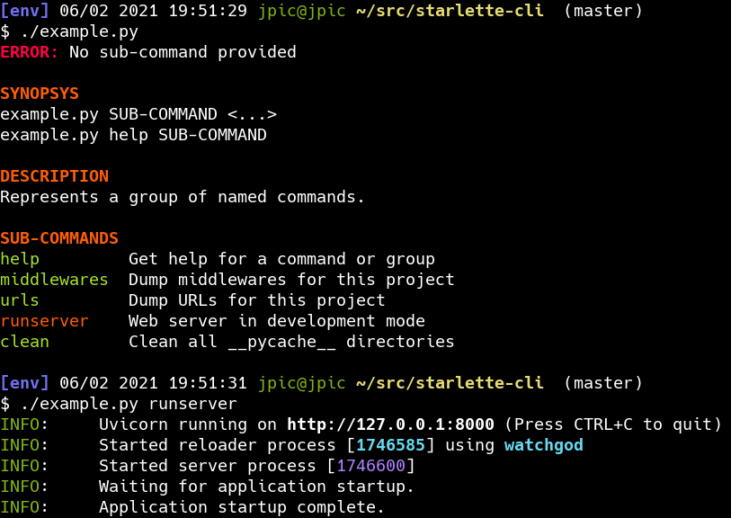
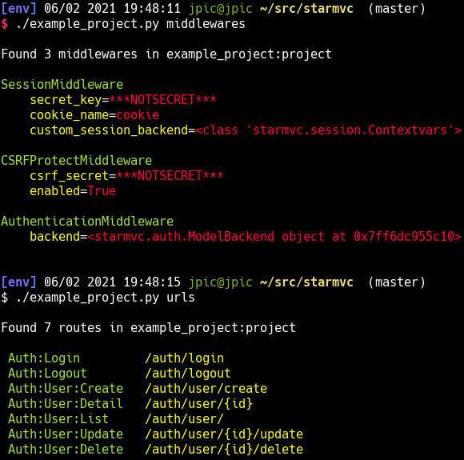

Starlette-cli: make your project a cli too!
~~~~~~~~~~~~~~~~~~~~~~~~~~~~~~~~~~~~~~~~~~~

This is a [starlette-app](https://yourlabs.io/oss/starlette-apps) that provides
a CLI with a few basic Starlette commands, and which your other apps may extend.

Example
=======

.. literalinclude:: example.com
  :language: python

Screenshots
===========

Help & runserver command:

Dumping urls and middlewares:

Install
=======

Install with::

    pip install starlette-cli

Extend
======

Add a new command to the CLI with:

.. code-block:: python

    from starlette_cli import cli

    @cli.cmd
    def your_command(...):
        """Your documentation"""

Or, from within another starlette-app if you have one:

.. code-block:: python

    class YourApp(apps.App):
        def setup(self):
            self.project.apps['cli'].add(your_command)
